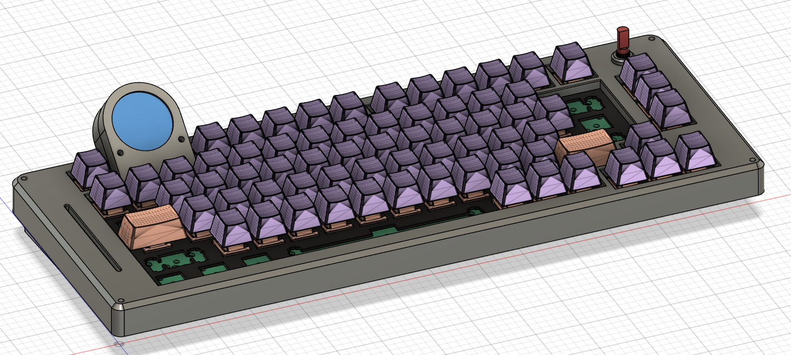
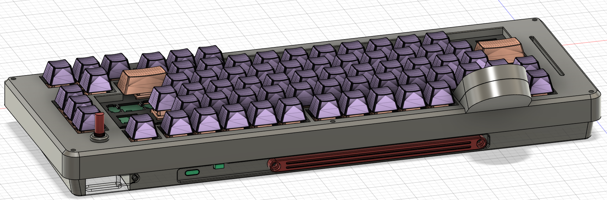
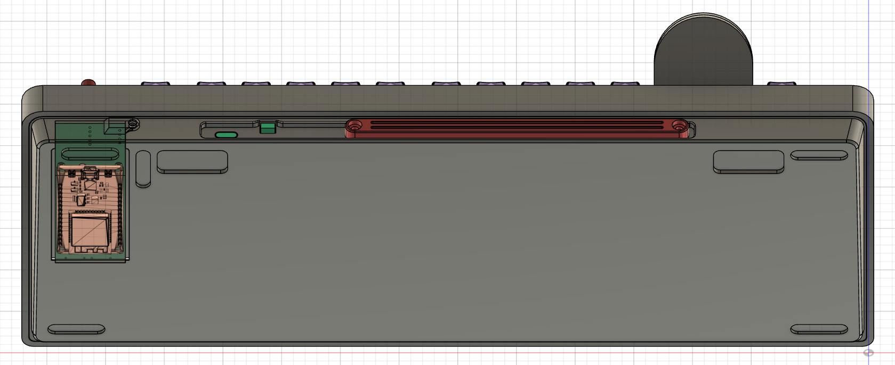
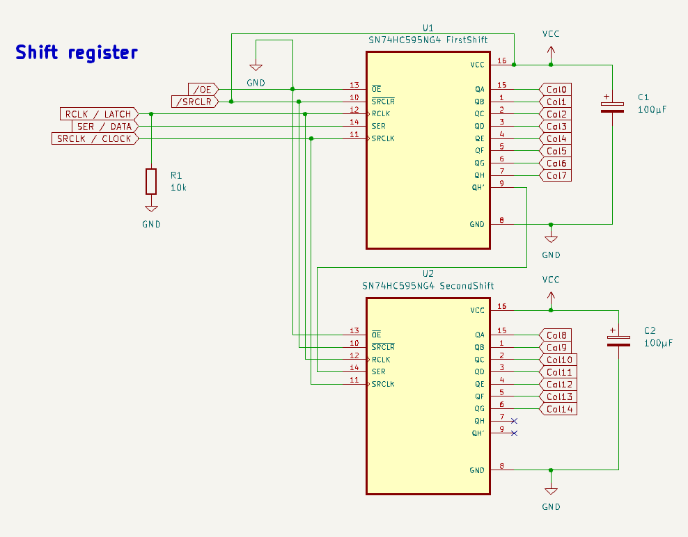
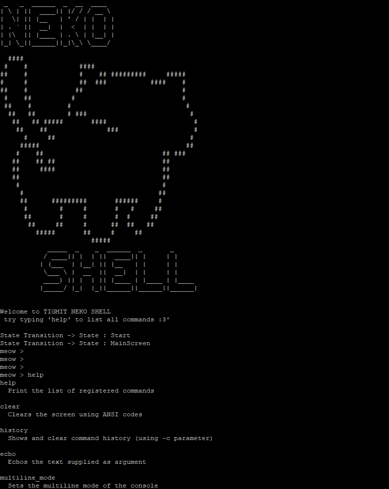

# TIGMIT NEKO BOARD 

This is a one man project trying to create (my) ultimate keyboard. taylored to the personal needs of a software developer with a thing for cute and weeby shit... hence the name :P 




the board features 

- 79 keys in a kind of.. compact TKL arrangement.
- a 240 x 240 round Display
- rotary encoder
- analog slider
- fully controllable RGB for each key
- hot swappable 
- the key-plate rests on foam pads to ensure a smoooth typing experience


it's a wireless board using bluetooth to connect to your devices :3

## The brain of the operation

is a esp32 vroom devkit. for now at least. perhaps i will change the controller at some point or integrate it onto the PCB.

anyways it can be accessed for programming via a lid in the bottom of the case as seen here:




it has a fixed angle between 4 and 5 degrees but supprts feet to change the angle to any requred needs really :3

to power the thing it uses a 8000mAh lipo battery with a breakout pcb that handles all of the power tasks like lipo protection and stepping up the battery voltage to 5V for the RGB LEDs

speaking of LEDs. the board has 79 adressable RGB LEDs. more specific SK6812MINI-E (datasheet in Documents/miscFiles Folder)

## KEY Matrix

the keys are arranged as a 6 x 15 Keymatrix. but wait. that uses a total of 21 I/O PINS?! how can we still controll a Display, a slider, and a Rotary encoder with pins to spare?????? well simple hehe the board has TWO 8 bit shift registers wich are controlled via SPI for maximum speeeed. gotta go fast kid.



this way its possible to save a massive ammount of pins. reducing the total ammount needed from 21 to basicllay just 8 pins for the whole keymatrix :P 

NOTE: its still very possible to reach a nice 1kHz polling rate for each key so there is no noticable lag when typing because we are utalizing SPI to controll the Shift registers :3

BUT! another trick is needed to pull all of this off with just one ESP32...

### Multicore processing

the esp32 features a delicios dual core MCU which we can use to our advantage hehe

Core 0 runs ONLY the key matrix polling and has priority over all the other tasks. to make absolutely sure that the keyboard... well... TYPES!

Core 1 handles all the other tasks like refreshing the display and running the Display Statemachine with alongside RGB tasks and sooo on. at the expense of a slightly slower refresh rate of the display. but its still fast enough for a nice experience :3 and the display has a buffer itself which eliminates the need to refresh it constantly all together ;P so we only need to update it in when we have to

# USING GC9A01 round TFT Display:

## setup:

### TFT_eSPI Lib

to use the GC9A01 Display, i am using the TFT_eSPI Lib by Bodmer'
https://github.com/Bodmer/TFT_eSPI
it requires some work to set it up for our particular Display.
thats why the TFT_eSPI was moved to the local libs folder in order to make it easyer to clone the repo.

if it does get lost then following changes need to be made in lib\TFT_eSPI\User_Setup.h:

 - select the right Driver. In Line 69 LOL ROFL (/* _ *)/  use #define GC9A01_DRIVER

 - set the requred Pin defines for the Display:

 - you can simply delete everything in the user_setup file and replace it with this setup:

[source,c++]
----
    #define USER_SETUP_INFO "User_Setup"
    #define DISABLE_ALL_LIBRARY_WARNINGS
    #define GC9A01_DRIVER

    #define TFT_MOSI 4  // SDA data signal          (Usr defined)
    #define TFT_SCLK 18 // Clock signal             (must be SCK on your board)
    #define TFT_CS 15   // Chip select control pin  (Usr defined)
    #define TFT_DC 2    // Data Command control pin (Usr defined)
    #define TFT_RST 5   // Reset pin                (Usr defined)

    // Comment out the #defines below with // to stop that font being loaded
    // The ESP8366 and ESP32 have plenty of memory so commenting out fonts is not
    // normally necessary. If all fonts are loaded the extra FLASH space required is
    // about 17Kbytes. To save FLASH space only enable the fonts you need!
    
    #define LOAD_GLCD // Font 1. Original Adafruit 8 pixel font needs ~1820 bytes in
                      // FLASH
    #define LOAD_FONT2 // Font 2. Small 16 pixel high font, needs ~3534 bytes in
                       // FLASH, 96 characters
    #define LOAD_FONT4 // Font 4. Medium 26 pixel high font, needs ~5848 bytes in
                       // FLASH, 96 characters
    #define LOAD_FONT6 // Font 6. Large 48 pixel font, needs ~2666 bytes in FLASH,
                       // only characters 1234567890:-.apm
    #define LOAD_FONT7 // Font 7. 7 segment 48 pixel font, needs ~2438 bytes in
                       // FLASH, only characters 1234567890:-.
    #define LOAD_FONT8 // Font 8. Large 75 pixel font needs ~3256 bytes in FLASH,
                       // only characters 1234567890:-.
    //#define LOAD_FONT8N // Font 8. Alternative to Font 8 above, slightly narrower,
    // so 3 digits fit a 160 pixel TFT
    #define LOAD_GFXFF // FreeFonts. Include access to the 48 Adafruit_GFX free
                       // fonts FF1 to FF48 and custom fonts
    
    // Comment out the #define below to stop the SPIFFS filing system and smooth
    // font code being loaded this will save ~20kbytes of FLASH
    #define SMOOTH_FONT
    
    // #define SPI_FREQUENCY   1000000
    // #define SPI_FREQUENCY   5000000
    // #define SPI_FREQUENCY  10000000
    // #define SPI_FREQUENCY  20000000
    #define SPI_FREQUENCY 27000000
    // #define SPI_FREQUENCY  40000000
    // #define SPI_FREQUENCY  55000000 // STM32 SPI1 only (SPI2 maximum is 27MHz)
    // #define SPI_FREQUENCY  80000000
    
    // Optional reduced SPI frequency for reading TFT
    #define SPI_READ_FREQUENCY 20000000
    
    // The XPT2046 requires a lower SPI clock rate of 2.5MHz so we define that here:
    #define SPI_TOUCH_FREQUENCY 2500000
----

connect these pins as per the defines and you should be good to go.

# NEKO SHELL

The project features a fully functional live console/Shell to debug and play around.

find more info on how to create your own commands inside ```NekoShell.hpp```

To enable the NEKO SHELL go to debugSettings.hpp and enable ```#define DEVMODE```




